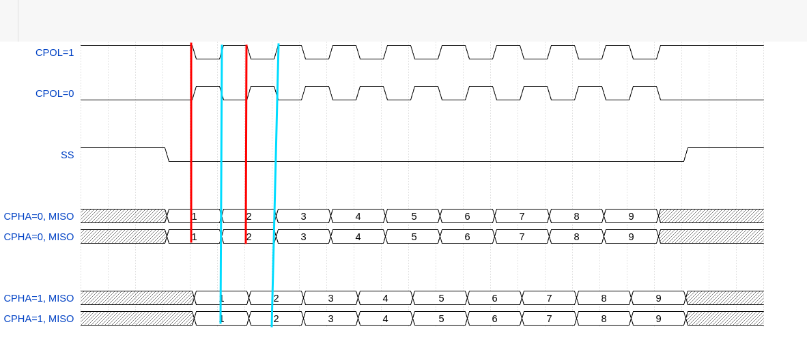

# SPI 设备

SPI (Serail Peripheral Interface, 串行外设接口) 总线系统是一种同步串行外设接口，它可以使 CPU 与各种外围设备以串行方式进行通信以交互信息，一般主控 SoC 作为 SPI 的 "主"，而外设作为 SPI 的 "从"

SPI 接口一般使用 4 条线：

1. 串行时钟线(SCLK)

用于给从设备提供通信时钟

2. 主机输入/从机输出线(MISO)

Master Input Slave Output, 用于主机从从机读取数据

3. 主机输出从机输入线(MOSI)

Master Output Slave Input, 用于主机往从机写入数据

4. 从机选择线 SYNC(或者叫SS等)

用于选择从机，低电平有效，在需要和从机通信的时候设置为低电平, 直到通信完成后再拉高

## 时序

SPI 总线工作时和两个模式值有关

1. CPOL

空闲状态下的极性，CPOL = 0, 串行同步时钟的空闲状态为低电平，CPOL = 1, 串行同步时钟的空闲状态为高电平

2. CPHA

相位, 采样的跳变沿, CPHA = 0, 在串行同步时钟的第一个跳变沿(上升或下降沿)数据被采样, CPHA = 1, 在串行同步时钟的第二个跳变沿(上升或下降沿)数据被采样

如下是 SPI 总线的时序

